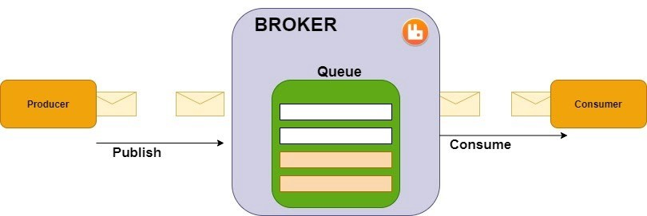
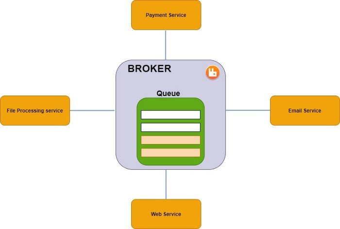
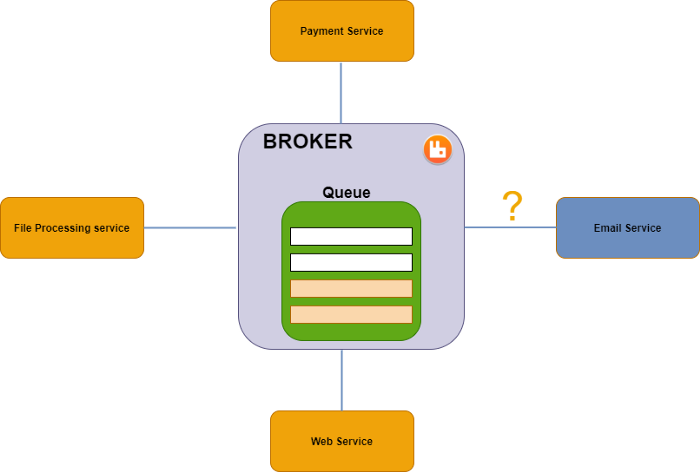
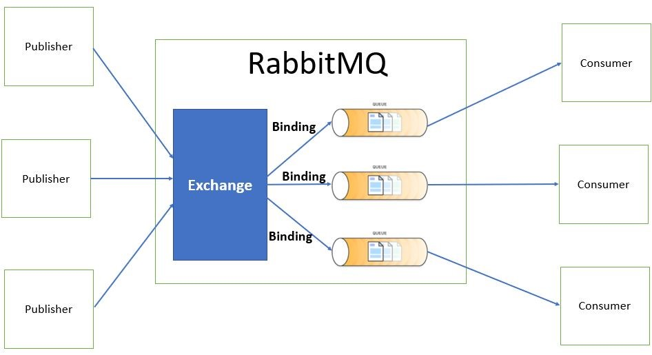
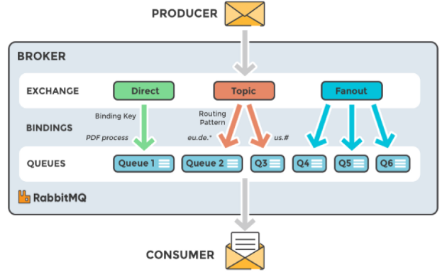
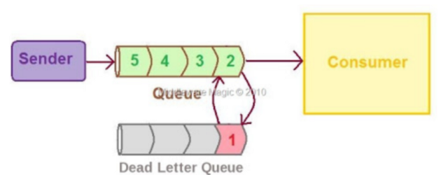
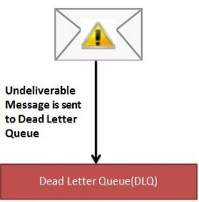
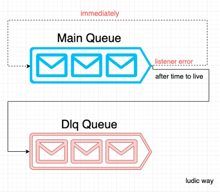
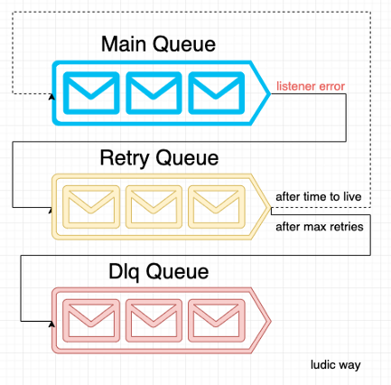

# RabbitMQ Interview Questions & Answers & Coding Exercise

> Click :star:if you like the project. Pull Request are highly appreciated. Follow me [@HasanMahmud](https://www.linkedin.com/in/codemechanix/) for technical updates.

**Note:** This repository is specific to RabbitMQ.

### Table of Contents

| No. | Questions |
| --- | --------- |
|1  | [What is Messaging?](#what-is-messaging)|
|2  | [What is RabbitMQ?](#what-is-rabbitmq) |
|3  | [What is Advanced Message Queuing Protocol?](#what-is-advanced-message-queuing-protocol)
|4  | [What is an exchange?](#what-is-an-exchange)|
|5  | [Types of exchange](#types-of-exchange)|
|6  | [How RabbitMQ Works?](#how-RabbitMQ-Works)|
|7  | [What is routing key in RabbitMQ?](#what-is-routing-key-in-RabbitMQ)|
|8  | [Does RabbitMQ have any concept of message priority?](#does-RabbitMQ-have-any-concept-of-message-priority)|
|9    | [How to consume messages from RabbitMQ using Spring Boot?](#how-to-consume-messages-from-RabbitMQ-using-Spring-Boot)|
|10 | [What is a Dead Letter Queue?](#what-is-a-Dead-Letter-Queue)|
|11 | [RabbitMQ Retry Strategy](#RabbitMQ-Retry-Strategy)
|12 | [Implement Direct Exchange, Topics Exchange, Fanout Exchange using Spring Boot and Rabbitmq (Consumer and Producer)](#spring-boot-rabbitmq-exchange-example)

## Core Message broker - RabbitMQ

1. ### What is Messaging?

   Messaging is a communication mechanism used for system interactions. In software development messaging enables
   distributed communication that is loosely coupled. A messaging client can send messages to, and receive messages
   from, any other client.

   **[⬆ Back to Top](#table-of-contents)**

2. ### What is RabbitMQ?

   RabbitMQ is a **message broker or queue manager** that implements the **AMQP protocol**. This means that he takes
   messages in a queue and sends them to consumers. A message can include any kind of information.

   

    - **Producer**: publishes a message to an exchange.
    - **Message**: any kind of information or data.
    - **Queue**: hold many messages, queue (first in, first out).
    - **Broker**: in our case the RabbitMQ, a broker can have many queues.
    - **Consumer**: is the system that receives the message from the broker.

   With a message broker, we can decouple [separate] our application easily. This means we use a microservice
   architecture.

   

   And Let's imagine that the Email Service is unavailable.

   

   That will not affect the other services, and the application still works.

   **[⬆ Back to Top](#table-of-contents)**

3. ### What is Advanced Message Queuing Protocol?

   The Advanced Message Queuing Protocol (AMQP) is an open standard application layer protocol for message-oriented
   middleware. AMQP 0-9-1 is a binary messaging protocol and semantic framework for microservices and enterprise
   messaging. RabbitMQ is based on AMQP 0-9-1 Protocol. RabbitMQ supports -

    - AMQP 0-9-1
    - AMQP 1.0
    - MQTT
    - STOMP
    - HTTP

   RabbitMQ Messaging Flow- Bindings are what connects the exchanges to queues.

   

   **[⬆ Back to Top](#table-of-contents)**

4. ### What is an exchange?

   RabbitMQ does not publish directly the messages to a queue but via an exchange.
   **Exchange** assure that the message is published to the right queue. Each exchange is linked to a queue via binding.

   **[⬆ Back to Top](#table-of-contents)**

5. ### Types of exchange

   There are 4 types of exchanges:
    1. **Direct exchange**: Direct the message to a specific queue by locking to the routing_key.

   A direct exchange delivers messages to queues based on a message routing key. The routing key is a message attribute
   added to the message header by the producer. Think of the routing key as an "address" that the exchange is using to
   decide how to route the message. A message goes to the queue(s) with the binding key that exactly matches the routing
   key of the message.

   The direct exchange type is useful to distinguish messages published to the same exchange using a simple string
   identifier.

   

    2. **Fanout Exchange**: A fanout exchange routes messages to all queues that are bound to it, and the routing key is
       ignored.

   A fanout exchange copies and routes a received message to all queues that are bound to it regardless of routing keys
   or pattern matching as with direct and topic exchanges. The keys provided will simply be ignored.

   Fanout exchanges can be useful when the same message needs to be sent to one or more queues with consumers who may
   process the same message in different ways

   

    3. **Topic Exchange**: Topic exchanges route messages to queues based on wildcard matches between the routing key
       and the routing pattern, which is specified by the queue binding. Messages are routed to one or many queues based
       on a matching between a message routing key and this pattern.

   The routing key must be a list of words, delimited by a period (.). Examples are agreements.us and
   agreements.eu.stockholm which in this case identifies agreements that are set up for a company with offices in lots
   of different locations. The routing patterns may contain an asterisk (“*”) to match a word in a specific position of
   the routing key (e.g., a routing pattern of "agreements.*.*.b.*" only match routing keys where the first word is "
   agreements" and the fourth word is "b"). A pound symbol (“#”) indicates a match of zero or more words (e.g., a
   routing pattern of "agreements.eu.berlin.#" matches any routing keys beginning with "agreements.eu.berlin").

   

    4. **Headers Exchange**:A headers exchange routes messages based on arguments containing headers and optional
       values. Headers exchanges are very similar to topic exchanges, but route messages based on header values instead
       of routing keys. A message matches if the value of the header equals the value specified upon binding.

   The default exchange AMQP brokers must provide for the topic exchange is "amq.headers".

   

   **[⬆ Back to Top](#table-of-contents)**

6. ### How RabbitMQ Works?

   We have 5 main roles in RabbitMQ scenario:

   

    1. We have the Producer, the application that needs to send the message. For this action, it needs to perform a
       connection to an Exchange, sending the message and the routing key information.
    2. The Exchange is responsible to receive the message and the routing key information. The principal purpose is,
       based on the type of the exchange and based on the routing key information previously shared and sent, the
       exchange can decide to which queue the message will be delivered. Later on this text we will explain more about
       the types of Exchanges.
    3. The Routing Key is a identifier that “Binds” the Exchange (based on it type) with the Queue. If this bind is not
       defined, your message, will not be delivered to anyone.
    4. The Queue, depending of the type, can retain your message or just erase it after it been consumed.
    5. And the Consumer application, that connects to a specific queue to “read” the message sent by the Producer.

   **[⬆ Back to Top](#table-of-contents)**

7. ### What is routing key in RabbitMQ?

   The routing key is a message attribute. The routing algorithm behind a direct exchange is simple - a message goes to
   the queues whose binding key exactly matches the routing key of the message.

   **[⬆ Back to Top](#table-of-contents)**

8. ### Does RabbitMQ have any concept of message priority?

   RabbitMQ does have concept of priority-
    - We can define the queue's priority range at the time the queue is created
    - Messages where priority is not set get a priority of 0
    - Messages with a numeric priority higher than the maximum set on the queue get the highest priority the queue
      supports

   **[⬆ Back to Top](#table-of-contents)**

9. ### How to consume messages from RabbitMQ using Spring Boot?

   To consume message from a RabbitMQ Queue we need to implement RabbitMQ listeners using Spring Boot.

   **[⬆ Back to Top](#table-of-contents)**

10. ### What is a Dead Letter Queue?

    In English vocabulary Dead letter mail is an undeliverable mail that cannot be delivered to the addressee. A
    dead-letter queue (DLQ), sometimes which is also known as an undelivered-message queue, is a holding queue for
    messages that cannot be delivered to their destinations due to some reason or other.

    According to Wikipedia page - In message queueing the dead letter queue is a service implementation to store
    messages that meet one or more of the following failure criteria:
    - Message that is sent to a queue that does not exist.
    - Queue length limit exceeded.
    - Message length limit exceeded.
    - Message is rejected by another queue exchange.
    - Message reaches a threshold read counter number, because it is not consumed. Sometimes this is called a "back out
      queue".

    

    Later on we can analyze the messages in the DLQ to know the reason why the messages are failing.

    

    RabbitMQ does not provide a retry strategy that allows us to control the whole life cycle of the message.

    RabbitMQ default behavior:

    - If you didn’t define the time-to-live argument, RabbitMQ will try to re-queue your message forever.
    - If you defined a TTL but didn’t define a dlx, after TTL, RabbitMQ will remove your message to the queue and you
      will lose the message.
    - If you defined a TTL and a dlx, after the TTL, RabbitMQ will send the message to the exchange defined in the dlx.

    **Definition**:

    - **TTL**: RabbitMQ allows you to set TTL (time to live) for both messages and queues. This can be done using
      optional queue arguments or policies (the latter option is recommended). Message TTL can be applied to a single
      queue, a group of queues or applied on the message-by-message basis.
    - **DLX**: Messages from a queue can be "dead-lettered"; that is, republished to an exchange when any of the
      following events occur:
        - The message is negatively acknowledged by a consumer using basic.reject or basic.nack with requeue parameter
          set to false.
        - The message expires due to per-message TTL; or
        - The message is dropped because its queue exceeded a length limit.

    Dead letter exchanges (DLXs) are normal exchanges. They can be any of the usual types and are declared as usual. For
    any given queue, a DLX can be defined by clients using the queue's arguments, or in the server using policies. In
    the case where both policy and arguments specify a DLX, the one specified in arguments overrules the one specified
    in policy.

    - **Safety of DLX**: Dead-lettered messages are re-published without publisher confirms turned on internally.
      Therefore, using DLX in a clustered RabbitMQ environment is not guaranteed to be safe. Messages are removed from
      the original queue immediately after publishing to the DLX target queue. This ensures that there is no chance of
      excessive message buildup that could exhaust broker resources, but messages can be lost if the target queue isn't
      available to accept messages. Dead-lettering a message modifies its headers:
        - the exchange name is replaced with that of the latest dead-letter exchange,
        - the routing key may be replaced with that specified in a queue performing dead lettering

    

    **[⬆ Back to Top](#table-of-contents)**

11. ### RabbitMQ Retry Strategy

    1. Default Spring AMQP

    With Spring AMQP default, you can define retry configurations using the properties below, where simple is the
    default container bean.

    But this strategy has a problem. By default, Spring AMQP will lock your queue when it tries to deliver the message
    in the retry process.

    To resolve this use a workaround: Define the concurrency. But this way we are overloading the JVM, and it’s not the
    best approach. If you have 5 messages (following the example) with issues, you’ll have the bottleneck again, and we
    still need to define the beans manually in our @Configuration bean for each connection and container.

    ```text
    spring.rabbitmq.listener.simple.retry.enabled=true
    spring.rabbitmq.listener.simple.retry.initial-interval=2000
    spring.rabbitmq.listener.simple.retry.max-attempts=5
    spring.rabbitmq.listener.simple.retry.multiplier=2
    spring.rabbitmq.listener.simple.max-concurrency=5
    spring.rabbitmq.listener.simple.concurrency=5
    ```

    2. Spring RabbitMQ Tuning

    This library creates a strategy using another queue for retries. With this, we can control the TTL using the
    expiration message property and we can use the x-death message property to control the number of retries.

    But how?

    We are using the dlx concept in the retry queue to re-queue a message in the main queue. Doing this, we have access
    to the x-death property and we can define programmatically the message expiration.

    Note: How this lib is an extension of Spring AMQP, if you want to use the default retry strategy, you can still use
    this lib only for auto configurations of beans.

    

    So, is it possible to use this strategy without the autoconfigure? I already have a lot of beans and I don’t have
    time to change it now.

    We know that the world is not perfect and thinking in situations like this, we create a feature flag that allows you
    to disable this autoconfiguration and use only the retry strategy and other benefits, like the management beans.

    You can disable the autoconfiguration, using the properties below:

    ```text
    spring.rabbitmq.enable.custom.autoconfiguration=false
    ```

    But I have 2 different connections, how can I proceed in this case?

    If you have more than 1 connection and you want to disable the autoconfiguration you need to provide the name of the
    RabbitTemplate bean for each connection.

    ```text
    spring.rabbitmq.custom.<YOUR_EVENT>.rabbitTemplateBeanName= <RABBITTEMPLATE_BEAN_NAME>
    ```

    Now you can still use our RabbitTemplateHandler bean to facilitate the experience with Spring AMQP.

    **[⬆ Back to Top](#table-of-contents)**

12. ### Spring boot Rabbitmq Exchange Example
    
    Project Link:: [Implement Direct Exchange, Topics Exchange, Fanout Exchange using Spring Boot and Rabbitmq (Consumer and Producer)](https://github.com/CodeMechanix/RabbitMQ-Interview-Questions/tree/main/Project)

    **[⬆ Back to Top](#table-of-contents)**
---

## Disclaimer

The questions provided in this repository are the summary of frequently asked questions across numerous companies. We
cannot guarantee that these questions will actually be asked during your interview process, nor should you focus on
memorizing all of them. The primary purpose is for you to get a sense of what some companies might ask — do not get
discouraged if you don't know the answer to all of them ⁠— that is ok!

Furthermore Collect Question and Answer from Different Blog.

Good luck with your interview 😊

---